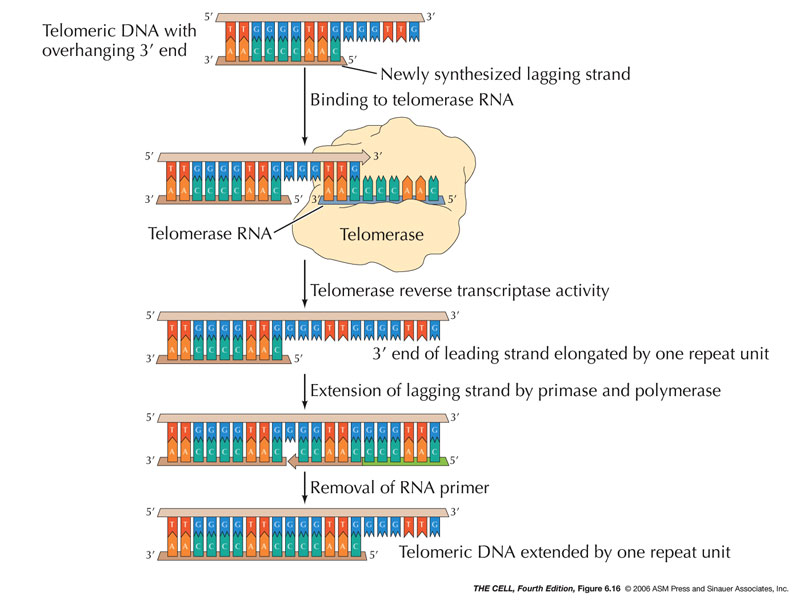
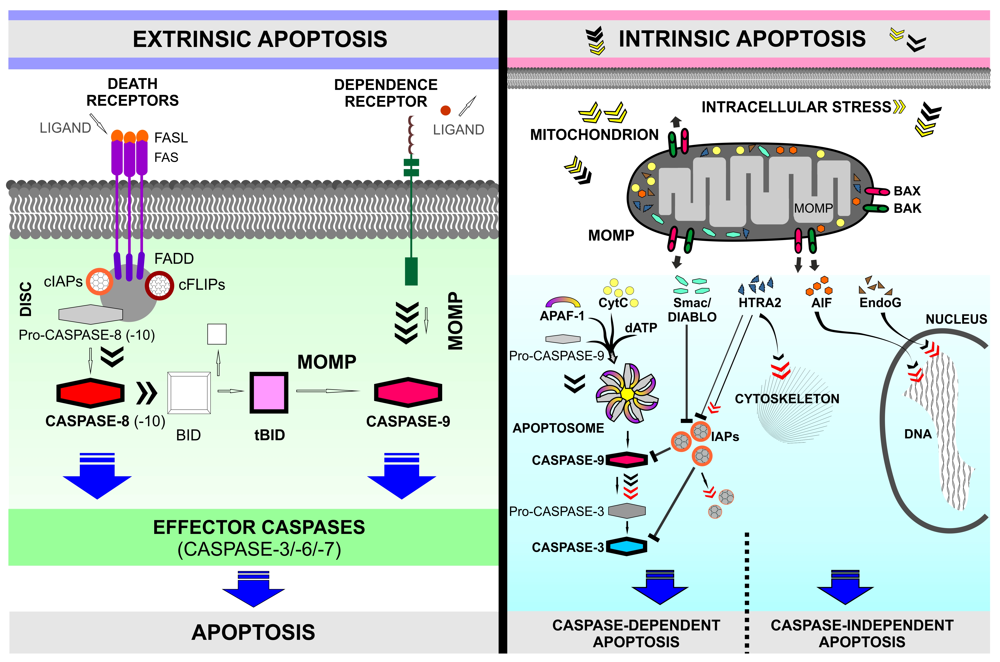

# Telomerase

- Telomerase is een enzym die met behulp van een RNA-template een telomeer verlengt. Omdat DNA wordt verlengt via RNA, wordt telomerase ook wel reverse-transcriptase genoemd.
- Telomeren zijn niet coderende stukken aan de uiteinde van het chromosomen. Zij werken als een buffer om een aantal delingen toe te laten, voordat coderend DNA verloren gaat
- DNA gaat verloren bij het delen doordat het laatste Okazi-fragment niet een 3-OH uiteinde aan de 5'-kant heeft. De verwijderde RNA-primers kunnen zo niet worden vervangers.
- Telomerase werkt door het telomeer van de leidende DNA-string te verlengen. Hierdoor kan DNA-polymerase een nieuw DNA-fragment bij achterblijvende string aan 5'-kant maken. Dit geeft weer een 3-OH uiteinde.

# Apoptose

- Apoptose is het bevel om een cel zelfmoord te laten plegen. Zelfmoord plegen houdt in dat proteolytische enzymen en DNase worden geactiveerd
- Apoptose kan via twee routes verlopen
	* Intrinsieke route → receptor-ligand onafhankelijke padweg
	* Extrinsiek route → receptor-ligand afhankelijke padweg

- Intrinsieke route begint bij de deactivatie van T53 inhibitors door DNA-schade. T53 leidt tot de verhoging van transcriptie van __bak__ en __bax__ eiwitten. Deze eitwitten maken het mitochondriaal eiwit cytochroom c vrij in het cytoplasma. Cytochroom c bevordert de vorming van apoptosoom. De apoptosoom activeert initiator caspases. Deze caspases activeren uitvoerende caspases, de daadwerkelijke proteolytische enzymen en activator van DNase. 
- Extrinsieke route begint bij binding van een bepaalde ligand aan een receptor. Dit receptor-ligand complex helpt bij het vormen van een zogenaamd Dood-inducerend signalerend complex (DISC). DISC activeert de initiator caspases die dan hetzelfde resultaat geven als de intrinsieke route.

